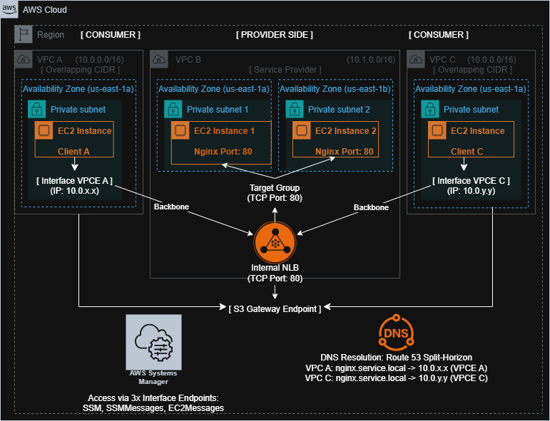

# AWS PrivateLink Solution: Overlapping CIDR Challenge



---

## 📌 Overview
Project ini mendokumentasikan implementasi **AWS PrivateLink** sebagai solusi untuk mengatasi konflik routing pada VPC dengan CIDR identik (**VPC A & VPC C: 10.0.0.0/16**). Arsitektur ini mengadopsi prinsip **Zero Trust & Cost-Efficient**, memastikan layanan tetap terisolasi tanpa memerlukan Internet Gateway, NAT Gateway, maupun Public IP.

---

## 🎯 Key Takeaways
* **Overlapping Resolution:** PrivateLink menghindari ketergantungan pada routing Layer 3 (CIDR) ❌.
* **Layer 4 Communication:** Konektivitas terjadi di level TCP melalui AWS Backbone Network.
* **Service-Level Abstraction:** Menggeser fokus dari *network-peering* ke *service-access*.
* **Egress Control:** Menggunakan **S3 Gateway Endpoint** untuk manajemen paket OS tanpa biaya NAT Gateway.
* **Zero Inbound Management:** Akses terminal melalui **AWS Systems Manager (SSM)** tanpa membuka port 22 (SSH).

---

## 💡 Arsitektur Logic (Golden Answer)
### Mengapa Tidak Terjadi Konflik Routing?
AWS PrivateLink bekerja pada **Layer 4 (TCP)** dan tidak menggunakan tabel routing antar VPC. Sebagai gantinya:
1. Setiap VPC Consumer memiliki **Interface Endpoint (ENI)** dengan IP lokal.
2. Trafik diarahkan ke **Network Load Balancer (NLB)** di VPC Provider via internal AWS network.

👉 Karena tidak ada pertukaran rute CIDR antar VPC, **overlapping CIDR tidak menjadi masalah.**

---

# I. Persiapan Infrastruktur VPC

## A. Provider (VPC B - 10.1.0.0/16)

### 1. Dasar Jaringan & Private Access
* **VPC Name:** `VPC-B-Provider` | **CIDR:** `10.1.0.0/16`
* **S3 Gateway Endpoint:** Dikonfigurasi pada **Route Table** VPC B. Gateway Endpoint bekerja dengan memodifikasi *route table* menggunakan AWS-managed prefix list (tanpa ENI).
* **IAM Role:** Menggunakan `LabInstanceRole` (AWS Academy) atau Role dengan policy `AmazonSSMManagedInstanceCore`.

### 2. Deploy Nginx Server (EC2)
**User Data Script:**
```bash
#!/bin/bash
# Instalasi melalui AWS-managed repositories via S3 Gateway Endpoint
yum update -y
yum install nginx -y
systemctl start nginx
systemctl enable nginx
echo "<h1>Welcome to Nginx via PrivateLink</h1>" > /usr/share/nginx/html/index.html
```

**Security Group (SG-Nginx-Provider):**
- Inbound: Allow TCP 80 dari CIDR Subnet NLB.
- Outbound: Allow HTTPS (443), dengan routing ke S3 dikontrol melalui Gateway Endpoint di Route Table.

### 3. Target Group
- Name: TG-Nginx-80 | Protocol: TCP | Port: 80
- Target: EC2 Nginx Instance.

## B. Consumer (VPC A & VPC C - 10.0.0.0/16)
### 1. VPC & Subnet (Overlapping)
- VPC A & C: 10.0.0.0/16 | Subnet: 10.0.1.0/24

### 2. Client EC2 (Probe)
- IAM Role: Pasang policy AmazonSSMManagedInstanceCore.
- Security Group: Tidak perlu membuka port inbound (termasuk port 22). SSM Session Manager bekerja melalui agent-based communication via AWS Control Plane.

# II. Implementasi PrivateLink
## A. Network Load Balancer (VPC B)
- Name: NLB-PrivateLink | Scheme: Internal.
- Listener: TCP 80 → Forward ke Target Group.

## B. Endpoint Service (VPC B)
- Attach ke NLB & Enable Acceptance Required.
- Service Name: com.amazonaws.vpce.us-east-1.vpce-svc-xxx

## C. Interface Endpoint (VPC A & VPC C)
- Service Category: Other endpoint services.
- Private DNS: Enabled (Contoh: nginx.service.local).
- Security Group Endpoint: Inbound TCP 80 dari EC2 client.

# III. Testing & Verification
## A. Accept Connection (VPC B)
- Menyetujui permintaan koneksi dari VPC A & C pada menu Endpoint Connections.

## B. Akses Terminal (SSM Session Manager)
Gunakan AWS Systems Manager untuk akses aman tanpa Public IP:
1. Pilih Instance Client A/C > Klik Connect.
2. Pilih tab Session Manager > Klik Connect.

## C. Testing Connectivity
```bash
# Test koneksi ke Nginx di VPC B via PrivateLink DNS
curl -Iv [http://nginx.service.local](http://nginx.service.local)
```

## ✅ Expected Result
- Client A & Client C mendapatkan response HTTP 200 OK.
- Source IP Behavior: Nginx mencatat IP privat dari NLB node, bukan IP asli client, menjaga abstraksi network tetap utuh.

# IV. Trade-offs Analysis
## Pros:
- ProsConsSolusi bersih untuk overlapping CIDR
- High security (Isolated dari internet)
- Efisiensi biaya (No NAT Gateway)

## Cons:
- Cost (NLB + Endpoint per AZ)
- Komunikasi bersifat Unidirectional\
- Setup lebih kompleks dibanding VPC Peering

# V. Alternative Approach
**Alternatif**: NAT Gateway / NAT Instance.

**Analisis**: NAT Gateway dapat melakukan IP Translation, namun biaya operasionalnya jauh lebih tinggi dan memperluas attack surface karena memberikan akses internet keluar secara umum.

# 🏁 Kesimpulan
Arsitektur ini mengeliminasi ketergantungan pada internet publik dan NAT Gateway, secara signifikan mengurangi biaya operasional sekaligus memperkuat postur keamanan. Solusi ini membuktikan bahwa komunikasi antar-VPC dapat dikelola secara efisien di level layanan (service-level), bahkan dalam kondisi konflik jaringan yang kompleks.
